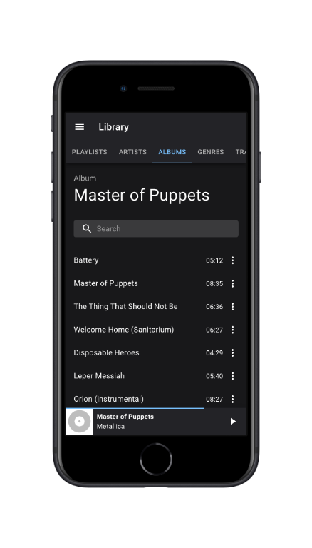
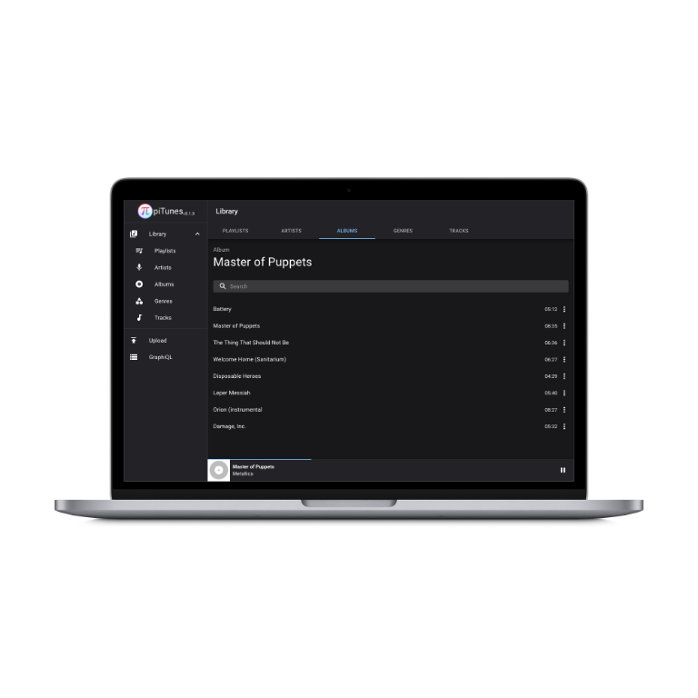

# pitunes has been archived and will no longer be maintained. Please switch to https://github.com/bernhardfritz/pytunes for continued support. Thanks!


Host your music yourself and stream it from anywhere using a web browser.

* Password protected
* Encrypted HTTPS traffic
* ID3 tag support
* Dark mode

[](https://labs.play-with-docker.com/?stack=https://raw.githubusercontent.com/bernhardfritz/pitunes/master/docker-compose.pwd.yml)

## Supported platforms

| Platform                                      | Release                                                                                                                                                                                                                                                                                                                                                                                                    |
| --------------------------------------------- | ---------------------------------------------------------------------------------------------------------------------------------------------------------------------------------------------------------------------------------------------------------------------------------------------------------------------------------------------------------------------------------------------------------- |
| :penguin:                                     | https://github.com/bernhardfritz/pitunes/releases/latest/download/pitunes-x86_64-unknown-linux-musl.tar.xz                                                                                                                                                                                                                                                                                                 |
| :strawberry:                                  | <table><tbody><tr><td>RPi&nbsp;1</td><td>https://github.com/bernhardfritz/pitunes/releases/latest/download/pitunes-arm-unknown-linux-musleabihf.tar.xz</td></tr><tr><td>RPi&nbsp;2+</td><td>https://github.com/bernhardfritz/pitunes/releases/latest/download/pitunes-armv7-unknown-linux-musleabihf.tar.xz</td></tr></tbody></table>                                                                      |
| :whale:                                       | https://hub.docker.com/r/bernhardfritz/pitunes                                                                                                                                                                                                                                                                                                                                                             |

## Quickstart

### Installation

```bash
wget <url>         # download release
tar -xf <filename> # extract archive
./pitunes          # start server
```

### Login

Enter server address in your web browser and login:

Username: `admin`

Password: `password`

### Change default password

Navigate to Graph*i*QL and execute:

Query:
```graphql
mutation UpdateUserMutation($username: String!, $input: UserInput!) {
  updateUser(username: $username, input: $input)
}
```

Query variables:
```json
{
  "username": "admin",
  "input": {
    "password": "something"
  }
}
```

Close and reopen browser after changing password.

## Screenshots




